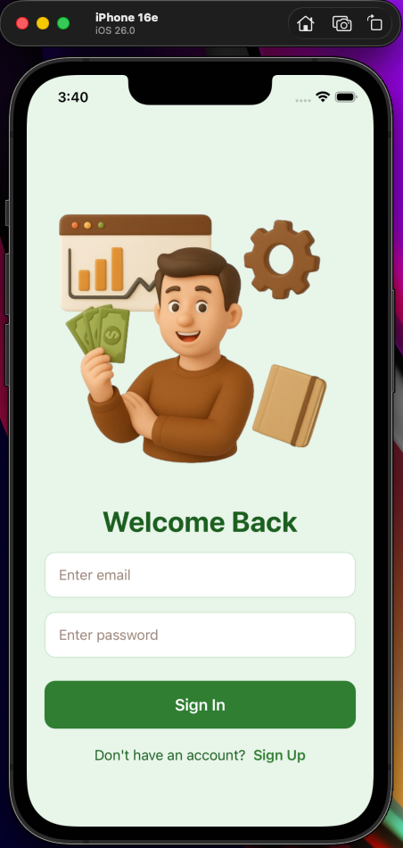
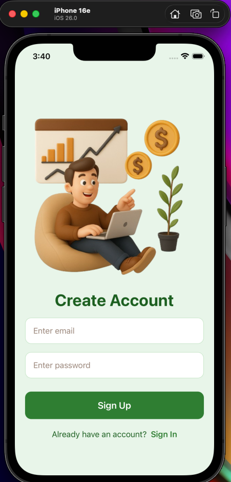
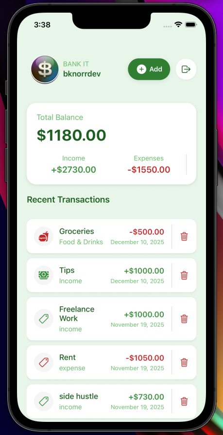
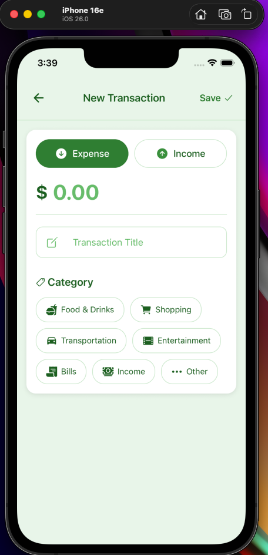

# 🏦 BanK It - Mobile Expense Tracker

**BanK It** is a full-stack, cross-platform mobile application designed to help users track their financial transactions in real-time. Built with a modern tech stack, it features secure authentication, a robust REST API with rate limiting, and a clean, responsive UI.


---

## 🚀 Features

* **Secure Authentication:** User sign-up and sign-in managed via **Clerk**.
* **Real-time Balance:** Dashboard automatically calculates total balance, income, and expenses.
* **Transaction History:** View all past transactions sorted by date.
* **Rate Limiting:** Backend API is protected against spam using **Upstash Redis**.
* **Auto-Scaling Database:** Data is persisted securely using **Neon (Serverless PostgreSQL)**.
* **Cross-Platform:** Optimized for both iOS and Android.

---

## 📱 Application Interface

**Authentication & Onboarding**
*Secure login and registration powered by Clerk.*

| Sign In Screen | Create Account |
| :---: | :---: |
|  |  |

**Dashboard & Management**
*Track your balance in real-time and easily add new income or expenses.*

| Home Dashboard | Add Transaction |
| :---: | :---: |
|  |  |

---

## 🛠️ Tech Stack

### Mobile (Frontend)
* **Framework:** React Native (via Expo)
* **Routing:** Expo Router
* **Authentication:** Clerk (`@clerk/clerk-expo`)
* **Styling:** Native StyleSheet

### Backend (API)
* **Runtime:** Node.js & Express.js
* **Database:** PostgreSQL (via Neon Serverless)
* **Caching:** Redis (via Upstash)
* **ORM/Driver:** `@neondatabase/serverless`

---

## ⚙️ Prerequisites

Before starting, ensure you have:
* [Node.js](https://nodejs.org/) installed.
* [Expo Go](https://expo.dev/client) app on your phone (or a Simulator).
* Accounts for:
  * [Neon](https://neon.tech/) (PostgreSQL)
  * [Upstash](https://upstash.com/) (Redis)
  * [Clerk](https://clerk.com/) (Authentication)

---

## 🔧 Installation & Setup

### 1. Clone the Repository

```bash
git clone [https://github.com/yourusername/reactnative-wallet.git](https://github.com/yourusername/reactnative-wallet.git)
```
```bash
cd reactnative-wallet
```

### 2. Backend Configuration
The backend handles API requests and database connections.

1.  **Navigate to the backend folder:**
    ```bash
    cd backend
    ```
2.  **Install dependencies:**
    ```bash
    npm install
    ```
3.  **Environment Variables:**
    Create a `.env` file in the `backend` root directory. Add the following keys (using your credentials from Neon and Upstash):

    ```env
    # Server Port (Default is 5001)
    PORT=5001

    # Neon Database Connection String
    DATABASE_URL=postgres://<user>:<password>@<host>/<dbname>?sslmode=require

    # Upstash Redis Keys (For Rate Limiting)
    UPSTASH_REDIS_REST_URL=[https://your-instance.upstash.io](https://your-instance.upstash.io)
    UPSTASH_REDIS_REST_TOKEN=your_upstash_token
    ```

4.  **Start the Server:**
    ```bash
    npm run dev
    # OR
    node src/server.js
    ```
    *Success Message: "Server is running on port: 5001" and "Database initialized SUCCESSFULLY"*

### 3. Database Setup (Automated)
This project is configured to **automatically create the required tables** when the server starts. You do not need to run manual SQL scripts.

For reference, the schema created is:
```sql
CREATE TABLE IF NOT EXISTS transactions(
    id SERIAL PRIMARY KEY,
    user_id VARCHAR(255) NOT NULL,
    title VARCHAR(255) NOT NULL,
    amount DECIMAL(10, 2) NOT NULL,
    category VARCHAR(100),
    created_at DATE NOT NULL DEFAULT CURRENT_DATE
);
```
### 4. Mobile App Configuration
The frontend is built with React Native and Expo. It requires specific environment variables to connect to your backend and authentication provider.

1.  **Navigate to the mobile directory:**
    ```bash
    cd ../mobile
    ```

2.  **Install Dependencies:**
    ```bash
    npm install
    ```

3.  **Environment Setup:**
    Create a new file named `.env` in the `mobile` root directory.
    * **CLERK_KEY:** Get this from your Clerk Dashboard (Developers > API Keys).
    * **API_URL:** Use your computer's local IP address (e.g., `192.168.1.5`) followed by port `5001`. Do not use `localhost` if testing on a physical device, as the phone cannot see "localhost" on your computer.

    ```env
    EXPO_PUBLIC_CLERK_PUBLISHABLE_KEY=pk_test_your_clerk_publishable_key
    EXPO_PUBLIC_API_URL=http://<YOUR_LOCAL_IP>:5001/api/transactions
    ```

### 5. Running the Application
Once the backend is running and the mobile app is configured, you can launch the application on your preferred device.

1.  **Ensure the Backend is Running:**
    If you haven't already, open a **separate terminal** window, navigate to `backend`, and run:
    ```bash
    npm run dev
    ```

2.  **Start the Mobile App:**
    In your **mobile terminal** window, run the Expo development server:
    ```bash
    npx expo start
    ```

3.  **Launch on Device:**
    * **Physical Android/iOS Device:** Download the **Expo Go** app from the App Store/Play Store. Open your camera app and scan the QR code shown in the terminal.
    * **Android Emulator:** Press `a` in the terminal window (requires Android Studio).
    * **iOS Simulator:** Press `i` in the terminal window (requires Xcode on macOS).
    * **Web Browser:** Press `w` to run the app in your browser.

## 📡 API Endpoints

Base URL: `http://localhost:5001/api/transactions`

| Method | Endpoint | Description | Required Body / Params |
| :--- | :--- | :--- | :--- |
| `GET` | `/:userId` | Get all transactions for a specific user | `userId` (URL Param) |
| `GET` | `/summary/:userId`| Get total balance, income, & expenses | `userId` (URL Param) |
| `POST` | `/` | Create a new transaction | `{ title, amount, category, user_id }` |
| `DELETE` | `/:id` | Delete a specific transaction | `id` (URL Param) |

---

## 🤝 Contributing

Contributions are what make the open-source community such an amazing place to learn, inspire, and create. Any contributions you make are **greatly appreciated**.

1.  **Fork the Project**
2.  **Create your Feature Branch** (`git checkout -b feature/AmazingFeature`)
3.  **Commit your Changes** (`git commit -m 'Add some AmazingFeature'`)
4.  **Push to the Branch** (`git push origin feature/AmazingFeature`)
5.  **Open a Pull Request**
